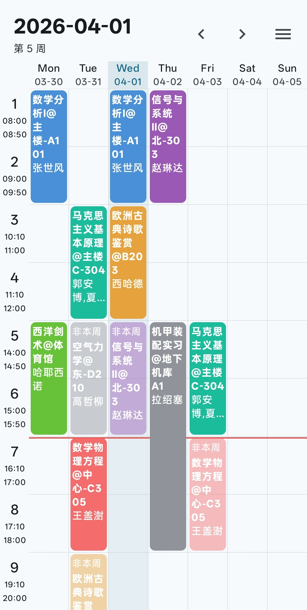
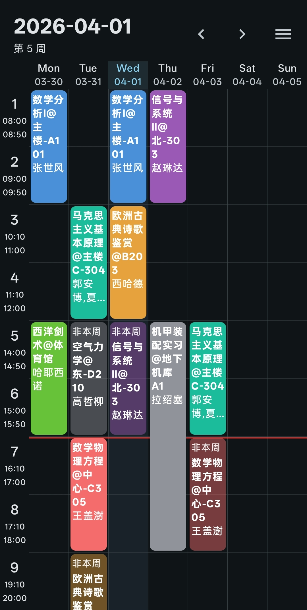

  

  <h1 align="center">
    SleepIn 课程表
  </h1>

  

    
     
    
    
    
     
    
    
    
    
  

**简体中文** | [English](./docs/README/README.en-US.md)

SleepIn 是一个开源、轻量、美观的 Android 课程表应用，旨在提供一个简洁、免费、无广告的课程表管理工具。

## ✨ 功能特性

目前已实现的一些基本功能：

- **作息表管理**：提供作息时间的设置和管理功能。用户可以创建多个作息表绑定不同课程表，自定义每天的作息时间，自定义每节课的上课时间。
- **课程表基础管理**：提供课程的添加、编辑、删除等基本功能，并提供一个一周视图的简洁美观的课程信息页面。
- **课程表导入导出**：支持从 CSV 文件导入和导出课程表数据，方便用户快速添加和备份课程信息。
- **桌面小组件**：提供课程表的桌面小组件，方便用户快速查看课程信息。

## 📷 截图预览

  
  

<!-- 

  
Light

  

  
Dark

  

 -->

## 🌏 国际化

由于软件设计之处仅考虑对中文的支持，其他语言的现实目前暂不清楚是否合适这套设计，因而暂未有国际化的计划。欢迎有兴趣的朋友通过 Issues 讨论国际化方案 或通过 Pull Request 的方式贡献你的翻译。