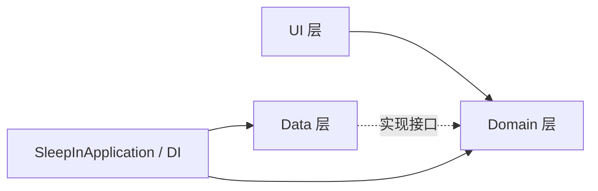
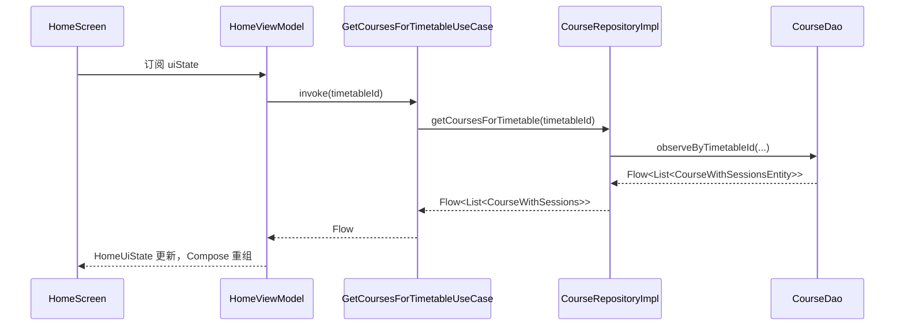

## 1. 背景与目标

本页先回答一个核心问题：**为什么 SleepIn 要分层**。

- 对 Android 新手来说，最大难点不是语法，而是“代码该放在哪一层”。
- SleepIn 采用 `MVVM + Clean Architecture`，目标是让 UI、业务规则、数据存储互相解耦。
- 本页先给结构总览，再给真实调用链，帮助你建立稳定的开发心智模型。

## 2. 相关模块与文件位置（先看树）

```text
app/src/main/java/com/kurosu/sleepin/
├─ MainActivity.kt                              # 单 Activity 入口，设置主题并挂载 NavHost
├─ SleepInApplication.kt                        # 手动 DI 根节点，集中创建 UseCase
├─ data/                                        # 数据实现层（Room/DataStore/CSV/RepositoryImpl）
├─ domain/                                      # 业务核心层（Model/Repository 接口/UseCase）
├─ ui/                                          # 展示层（Screen/ViewModel/Navigation/Compose 组件）
├─ di/
│  ├─ DatabaseModule.kt                         # Room Database 与 DAO 提供
│  └─ RepositoryModule.kt                       # Repository 与 CSV 组件提供
└─ widget/                                      # 小组件与 WorkManager 刷新链路
```

## 3. 架构总图与依赖方向



依赖规则（必须遵守）：

- UI 可以依赖 Domain，但不能直接依赖 DAO/Entity。
- Domain 不依赖 Android 框架。
- Data 实现 Domain 的 Repository 接口。
- `SleepInApplication` 负责在启动时把依赖串起来。

## 4. 分层讲解（每层先看文件，再看职责）

### 4.1 Domain 层（业务规则中心）

```text
domain/
├─ model/                                       # Course、Timetable、Schedule 等领域模型
├─ repository/                                  # CourseRepository 等接口定义
└─ usecase/                                     # AddCourseUseCase 等业务动作
```

- 这一层描述“业务上要做什么”，不关心 Room 或 Compose。
- UseCase 通过 `operator fun invoke` 作为统一业务入口，方便 ViewModel 调用和测试。

### 4.2 Data 层（数据来源与持久化）

```text
data/
├─ local/                                       # SleepInDatabase、Entity、DAO、Mapper
├─ repository/                                  # XxxRepositoryImpl 具体实现
├─ preferences/                                 # DataStore 设置读写
└─ csv/                                         # CsvImporter/CsvExporter
```

- 负责把数据库结构（Entity）映射成领域结构（Model）。
- 对上层暴露的是 Repository 接口行为，而不是底层 SQL 细节。

### 4.3 UI 层（状态驱动渲染）

```text
ui/
├─ navigation/SleepInNavHost.kt                 # 路由与 ViewModel 工厂装配
└─ screen/*                                     # Screen + ViewModel
```

- ViewModel 负责收集 UseCase 数据、产出 `StateFlow`。
- Compose Screen 只做渲染与事件转发，不承载核心业务规则。

### 4.4 DI 与应用入口（手动注入）

```text
SleepInApplication.kt
di/DatabaseModule.kt
di/RepositoryModule.kt
```

- 项目当前未启用 Hilt，采用手动 DI。
- `SleepInApplication` 中创建 `Database -> Repository -> UseCase`，供导航层取用。

## 5. 核心流程（主页课程展示调用链）



## 6. 新功能如何落地（标准步骤）

以“新增一个业务功能”举例，按这个顺序做：

1. 在 `domain/model` 定义领域模型。
2. 在 `domain/repository` 定义接口能力。
3. 在 `domain/usecase` 实现业务动作。
4. 在 `data/local` + `data/repository` 落地存储与实现。
5. 在 `SleepInApplication.kt` 组装新依赖。
6. 在 `ui/screen` 增加 ViewModel 和 Screen，并在 `ui/navigation/SleepInNavHost.kt` 接入路由。

## 7. 调试与排错建议

- 如果页面不刷新，先检查 ViewModel 是否在收集 `Flow` 并映射到 `StateFlow`。
- 如果出现越层调用，优先检查 UI 是否直接依赖了 DAO 或 Entity。
- 如果依赖注入报错，先从 `SleepInApplication.kt` 的初始化链路逐级核对。

## 8. 延伸阅读与下一步

- 下一篇建议阅读：`docs/SleepIn-Docs/docs/dev/module-responsibilities.md`
- 然后进入主链细节：`data-model-room.md` -> `business/usecase-chain.md` -> `ui-viewmodel-compose.md`
