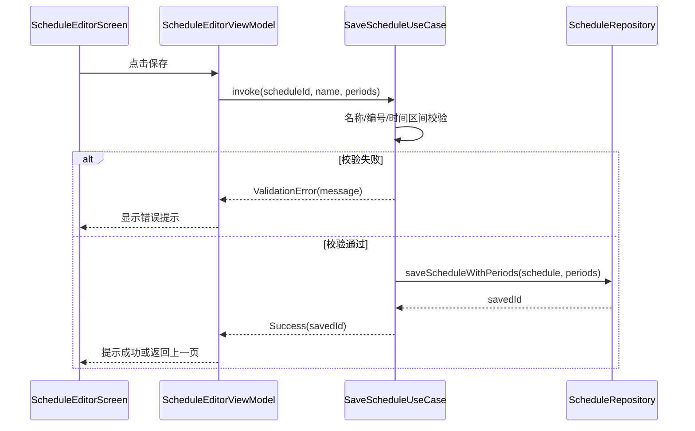

## 1. 背景与目标

如果你把 SleepIn 的代码看成一条流水线，那么 UseCase 就是中间的“业务工位”。

- ViewModel 把用户意图交给 UseCase。
- UseCase 负责校验、规则判断、调用 Repository。
- 这样 UI 和数据存储可以彼此独立演进。

## 2. 相关模块与文件位置（先看树）

```text
app/src/main/java/com/kurosu/sleepin/domain/
├─ model/                                         # 业务模型
├─ repository/                                    # 仓库接口
└─ usecase/
   ├─ course/                                     # 课程相关用例
   ├─ schedule/                                   # 作息模板相关用例
   ├─ timetable/                                  # 学期课表相关用例
   ├─ csv/                                        # CSV 导入导出用例
   └─ settings/                                   # 设置相关用例
```

示例文件：

- `app/src/main/java/com/kurosu/sleepin/domain/usecase/schedule/SaveScheduleUseCase.kt`
- `app/src/main/java/com/kurosu/sleepin/domain/usecase/course/AddCourseUseCase.kt`
- `app/src/main/java/com/kurosu/sleepin/domain/usecase/timetable/CreateTimetableUseCase.kt`

## 3. UseCase 在本项目中的定位

UseCase 负责三类事情：

1. 校验输入（例如名称为空、周数非法）。
2. 执行业务规则（例如课节时间不能重叠）。
3. 组织调用顺序（例如先创建课表，再导入 CSV）。

SleepIn 中大量 UseCase 使用 `operator fun invoke`，所以在 ViewModel 里可以像函数一样调用：

```kotlin
val result = saveScheduleUseCase(
    scheduleId = null,
    name = "春季作息",
    createdAt = null,
    periods = periods
)
```

## 4. 核心流程：`SaveScheduleUseCase`



对应代码位置：`app/src/main/java/com/kurosu/sleepin/domain/usecase/schedule/SaveScheduleUseCase.kt`

## 5. 关键实现细节

### 5.1 返回结果模型而不是直接抛异常

- `SaveScheduleResult.Success`
- `SaveScheduleResult.ValidationError`

好处是 UI 可以直接根据结果更新状态，不必把所有业务失败都当作崩溃异常处理。

### 5.2 UseCase 依赖接口，不依赖实现

- `SaveScheduleUseCase` 构造函数接收 `ScheduleRepository`（接口）。
- 具体实现由 Data 层和 DI 层提供，便于单元测试替换。

### 5.3 与 ViewModel 的协作边界

- ViewModel 负责把文本输入解析成可用参数。
- UseCase 负责最终业务校验与持久化决策。
- Screen 只做事件触发和状态渲染。

## 6. 常见错误与排错

### 6.1 业务规则写在 Screen 中

- 现象：Compose 页面里出现大量规则判断。
- 修复：把规则移到 UseCase，UI 只消费最终结果。

### 6.2 UseCase 混入 Android API

- 现象：UseCase 参数里出现 `Context`、`Uri`。
- 修复：系统 API 放到 Data/UI 层，UseCase 只接收纯 Kotlin 数据。

### 6.3 调用链难以追踪

- 建议从 `SleepInNavHost.kt` 找 ViewModel 构造，再跳到对应 UseCase，最后看 RepositoryImpl。

## 7. 延伸阅读与下一步

- 下一篇建议：`docs/SleepIn-Docs/docs/dev/ui-viewmodel-compose.md`
- 如果想看文件输入输出链路：`docs/SleepIn-Docs/docs/dev/business/csv-integration.md`
