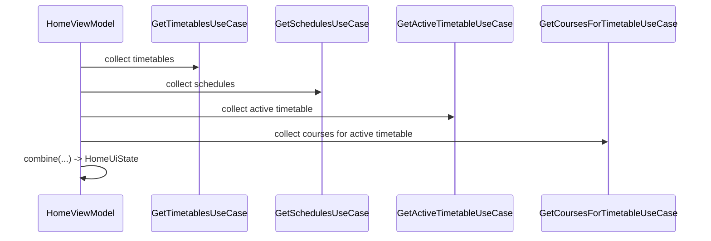

## 1. 背景与目标

本页面向 Android 初学者，先回答三个问题：

1. UI 状态从哪里来？
2. UI 状态如何更新？
3. 为什么要把状态和一次性事件分开？

## 2. 相关模块与文件位置（先看树）

```text
app/src/main/java/com/kurosu/sleepin/ui/
├─ navigation/
│  ├─ Screen.kt                                  # 路由定义
│  └─ SleepInNavHost.kt                          # 导航图 + ViewModel 创建
├─ screen/
│  ├─ home/                                      # 首页课程网格
│  ├─ course/                                    # 课程列表与编辑
│  ├─ schedule/                                  # 作息模板列表与编辑
│  ├─ timetable/                                 # 学期课表列表与编辑
│  └─ settings/                                  # 设置页
├─ component/                                    # 可复用 Compose 组件
└─ theme/                                        # Material 3 主题与颜色
```

## 3. UI 层职责拆分

- `*Screen.kt`：渲染状态 + 上报用户事件。
- `*ViewModel.kt`：组合数据流、调用 UseCase、输出 `StateFlow`。
- `SleepInNavHost.kt`：在路由处创建 ViewModel，并从 `SleepInApplication` 传入依赖。

## 4. 核心流程：`HomeViewModel` 多源状态聚合

关键文件：`app/src/main/java/com/kurosu/sleepin/ui/screen/home/HomeViewModel.kt`



这部分的重点是：

- 通过 `combine(...)` 把多个数据源合并为一个 `HomeUiState`。
- `manualSelectedWeek` 用可空值表示“是否覆盖自动周次”。
- `now` 每分钟更新，用于当前时间线和今日高亮。

## 5. 状态与事件：为什么分开

### 5.1 持久状态：`StateFlow`

典型写法（各编辑器 ViewModel 都类似）：

```kotlin
private val _uiState = MutableStateFlow(TimetableEditorUiState())
val uiState: StateFlow<TimetableEditorUiState> = _uiState.asStateFlow()
```

### 5.2 一次性事件：`SharedFlow`

典型场景：保存成功后返回、导出 CSV 触发系统保存器。

```kotlin
private val _events = MutableSharedFlow<TimetableEditorEvent>()
val events: SharedFlow<TimetableEditorEvent> = _events.asSharedFlow()
```

这样可以避免旋转屏或重组导致重复导航。

## 6. Compose 收集模式（推荐）

```kotlin
val uiState by viewModel.uiState.collectAsStateWithLifecycle()

LaunchedEffect(viewModel) {
	viewModel.events.collect { event ->
		// 导航、弹窗、文件保存等副作用
	}
}
```

原则：

- Composable 主体负责“画界面”。
- `LaunchedEffect` 负责“做副作用”。

## 7. 导航与手动 DI 在 UI 的落点

关键文件：`app/src/main/java/com/kurosu/sleepin/ui/navigation/SleepInNavHost.kt`

当前项目未启用 Hilt，导航中通过 `SleepInApplication` 取 UseCase：

示例参数注入（节选）：

- `getTimetablesUseCase = app.getTimetablesUseCase`
- `getSchedulesUseCase = app.getSchedulesUseCase`
- `getActiveTimetableUseCase = app.getActiveTimetableUseCase`
- `getCoursesForTimetableUseCase = app.getCoursesForTimetableUseCase`
- `getScheduleDetailUseCase = app.getScheduleDetailUseCase`
- `setActiveTimetableUseCase = app.setActiveTimetableUseCase`

这让依赖路径可见、可追踪，便于新同学快速定位问题。

## 8. 新页面开发模板

1. 定义 `XxxUiState`（持久状态）。
2. 定义 `XxxEvent`（一次性事件）。
3. ViewModel 中实现 `_uiState`、`_events` 与事件函数。
4. Screen 使用 `collectAsStateWithLifecycle` + `LaunchedEffect`。
5. 在 `SleepInNavHost.kt` 注册路由并注入依赖。

## 9. 常见问题与排错

- 页面重复弹窗：检查是否把副作用写在 Composable 主体。
- 页面不刷新：检查是否使用 `Flow/StateFlow` 持续收集。
- 输入中间态崩溃：编辑态先保存字符串，保存时再做 `toIntOrNull()/parse`。

## 10. CSV 交互在 UI 层的边界示例（作息表）

关键文件：`app/src/main/java/com/kurosu/sleepin/ui/screen/schedule/ScheduleEditorViewModel.kt`

- `isEditMode` 控制入口分支：
  - 新建页显示“导入CSV并创建作息表”。
  - 编辑页显示“导出当前作息表CSV”。
- 导入错误详情通过 `csvImportErrorDetail` 进入 `AlertDialog`，属于“状态驱动 UI”。
- 导出文件保存通过 `ScheduleEditorEvent.ExportCsvReady` 触发，属于“一次性事件”。

这个模式和课程表编辑器中的 CSV 交互一致，可以作为新增文件类功能（备份、导入、导出）的标准模板。

下一篇建议阅读：`docs/SleepIn-Docs/docs/dev/3.business/4.csv-integration.md`
