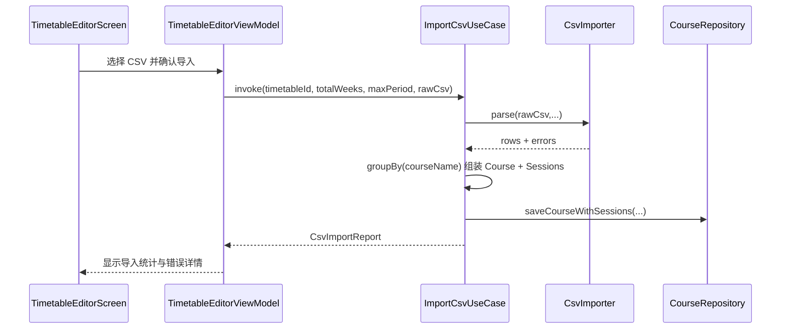
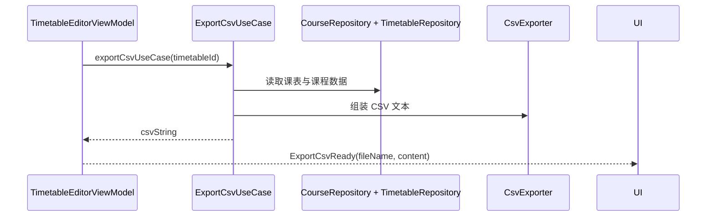

## 1. 背景与目标

CSV 功能是 SleepIn 的“批量数据入口/出口”。

- 导入：把外部文件转换为课程与课时数据。
- 导出：把当前课表转为可分享的 CSV 文本。
- 核心挑战是“扁平文本行”到“课程-课时一对多关系”的映射。

## 2. 相关模块与文件位置（先看树）

```text
app/src/main/java/com/kurosu/sleepin/
├─ data/csv/
│  ├─ CsvCodec.kt                                # CSV 行编解码
│  ├─ CsvImporter.kt                             # 解析 + 行级校验
│  └─ CsvExporter.kt                             # 导出文本生成
├─ domain/usecase/csv/
│  ├─ ImportCsvUseCase.kt                        # 导入主流程
│  ├─ ExportCsvUseCase.kt                        # 导出主流程
│  └─ CsvImportModels.kt                         # CsvCourseRow/CsvImportReport 等
└─ ui/screen/timetable/TimetableEditorViewModel.kt # UI 触发导入导出
```

## 3. 导入主流程（总览）



## 4. 关键实现细节

### 4.1 `withContext(Dispatchers.IO)`

`ImportCsvUseCase` 在 IO 线程执行解析与持久化，避免阻塞主线程。

文件：`app/src/main/java/com/kurosu/sleepin/domain/usecase/csv/ImportCsvUseCase.kt`

### 4.2 扁平行到一对多模型

- CSV 每行通常表示一次上课时段。
- 导入时按课程名分组：同名行聚合为 1 个 `Course` + N 个 `CourseSession`。

这一步由 `ImportCsvUseCase` 通过 `groupBy { it.name.trim().lowercase() }` 完成。

### 4.3 周次规则解析

`CsvImporter.kt` 支持新旧两类周次表达：

- 新格式：`周次/Weeks`（如 `1-16`、`1;3;5`、`1-16(odd)`）。
- 旧格式：`WeekType + StartWeek + EndWeek + CustomWeeks` 兼容解析。

目标是兼容历史文件并减少用户迁移成本。

### 4.4 Domain 保持无 Android 依赖

- UseCase 输入是纯文本 `rawCsv`，不是 `Uri`。
- 读取 `Uri` 与 `ContentResolver` 的逻辑放在 UI 层。

这保证 Domain 可以被独立测试。

## 5. 导出主流程（总览）



## 6. 常见问题与排错

### 6.1 导入完成但条目为 0

- 先检查 `CsvImportReport.errors`。
- 重点看周次字段、节次范围是否超出 `maxPeriod`。

### 6.2 导入后课程重复

- 当前策略是“追加插入”，不是“覆盖导入”。
- 若业务需要幂等导入，需要额外设计去重策略。

### 6.3 文件解析乱码

- 优先检查读取流编码。
- 可在 UI 层尝试显式指定字符集后再传 `rawCsv`。

## 7. 延伸阅读与下一步

- Widget 刷新与导入后的联动：`docs/SleepIn-Docs/docs/dev/widget-workmanager.md`
- 全局排错：`docs/SleepIn-Docs/docs/dev/troubleshooting.md`
