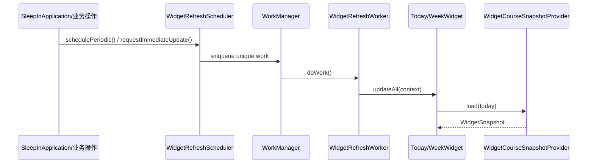

## 1. 背景与目标

SleepIn 提供两个桌面小组件：

- `Today`：今日课程视图
- `Week`：本周概览视图

因为 Widget 运行在 Launcher 相关进程中，不能依赖 Activity 生命周期，所以必须有独立刷新链路。

## 2. 相关模块与文件位置（先看树）

```text
app/src/main/java/com/kurosu/sleepin/widget/
├─ TodayWidgetProvider.kt                         # Today 组件 UI 与 Provider
├─ WeekWidgetProvider.kt                          # Week 组件 UI 与 Provider
├─ WidgetCourseSnapshotProvider.kt                # 复用 UseCase 组装快照数据
├─ WidgetRefreshScheduler.kt                      # 周期/即时刷新调度入口
└─ WidgetRefreshWorker.kt                         # WorkManager Worker
```

## 3. 刷新链路总览



## 4. 分模块讲解

### 4.1 Provider：只负责渲染

- `TodayWidgetProvider.kt` / `WeekWidgetProvider.kt`
- 主要职责：
  - 触发快照加载
  - 把 `WidgetSnapshot` 转为 Glance UI
  - 处理空态（如无 active timetable）

### 4.2 Snapshot Provider：业务一致性关键层

文件：`app/src/main/java/com/kurosu/sleepin/widget/WidgetCourseSnapshotProvider.kt`

它通过应用内 UseCase 取数，而不是直接写 SQL：

- `observeSettingsUseCase()`
- `getActiveTimetableUseCase()`
- `getScheduleDetailUseCase()`
- `getCoursesForTimetableUseCase()`

这样可保证 Widget 与 Home 页面遵循同一套周次过滤和课程可见性规则。

### 4.3 Scheduler：定义刷新策略

文件：`app/src/main/java/com/kurosu/sleepin/widget/WidgetRefreshScheduler.kt`

- `schedulePeriodic(context)`：30 分钟周期刷新，`ExistingPeriodicWorkPolicy.UPDATE`。
- `requestImmediateUpdate(context)`：交互后即时刷新，`ExistingWorkPolicy.REPLACE`。

### 4.4 Worker：执行刷新动作

文件：`app/src/main/java/com/kurosu/sleepin/widget/WidgetRefreshWorker.kt`

- `doWork()` 中调用 `TodayWidget.updateAll()` 与 `WeekWidget.updateAll()`。
- 异常时返回 `Result.retry()`，避免静默失败。

## 5. 与主应用联动位置

关键入口：`app/src/main/java/com/kurosu/sleepin/SleepInApplication.kt`

- 应用启动时会初始化周期刷新并触发一次即时刷新。
- 监听 Room 表失效（`invalidationTracker`）后会请求即时刷新。

这意味着：数据变更后，Widget 通常能自动跟进更新。

## 6. 常见问题与排错

### 6.1 小组件不刷新

1. 检查是否调用了 `WidgetRefreshScheduler.requestImmediateUpdate(context)`。
2. 检查 `WidgetRefreshWorker` 是否持续重试。
3. 检查 Provider 是否处理了快照异常和空态。

### 6.2 Widget 与 App 数据不一致

- 核对快照是否通过 UseCase 取数。
- 检查课表切换、课程编辑后是否触发了即时刷新。

### 6.3 深色/浅色主题可读性差

- 检查 `WidgetPalette` 对比度与前景色。
- 避免依赖“系统自动前景色”推断。

## 7. 延伸阅读与下一步

- 业务主链：`docs/SleepIn-Docs/docs/dev/business/usecase-chain.md`
- 全局排障：`docs/SleepIn-Docs/docs/dev/troubleshooting.md`
