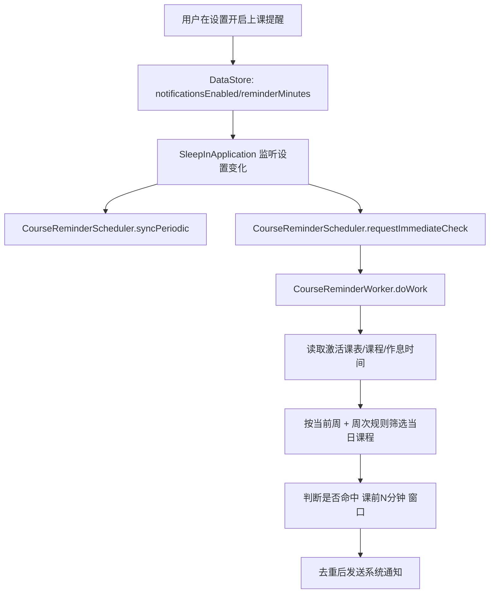

本文说明 SleepIn 新增的“上课前通知”能力，重点覆盖设置联动、WorkManager 调度、提醒计算规则与 Android 13+ 通知权限行为。

## 1. 背景与目标

### 1.1 功能目标

- 用户在设置页开启“上课提醒”后，系统可以在上课前 N 分钟发送通知。
- 提醒分钟数沿用设置中的 `reminderMinutes`（例如 5/10/15/30 分钟）。
- 课程、作息表、当前激活课表变化后，提醒计算可以快速同步。

### 1.2 设计约束

- 保持现有手动 DI，不引入 Hilt。
- 复用现有“学期周次计算 + 周次可见性”业务规则，避免与首页/小组件出现不一致。
- 后台任务采用 WorkManager，保证在 App 不在前台时仍可执行。
- Android 13+ 必须显式申请 `POST_NOTIFICATIONS` 运行时权限。

## 2. 代码位置

- 设置与权限入口
  - `app/src/main/java/com/kurosu/sleepin/MainActivity.kt`
  - `app/src/main/AndroidManifest.xml`
- 调度层
  - `app/src/main/java/com/kurosu/sleepin/reminder/CourseReminderScheduler.kt`
- 执行层（Worker）
  - `app/src/main/java/com/kurosu/sleepin/reminder/CourseReminderWorker.kt`
- 应用启动与设置联动
  - `app/src/main/java/com/kurosu/sleepin/SleepInApplication.kt`
- 复用的周次计算逻辑
  - `app/src/main/java/com/kurosu/sleepin/ui/screen/home/HomeWeekDateCalculator.kt`

## 3. 核心流程

## 4. 关键实现细节

### 4.1 调度策略

`CourseReminderScheduler` 维护两类任务：

- 周期任务：15 分钟一次（WorkManager 允许的最小周期）。
- 立即任务：用于设置变化、数据库变化后的快速重算。

`SleepInApplication` 中做了两种触发：

- 监听 `notificationsEnabled/reminderMinutes`，变更后同步周期任务并触发一次立即检查。
- Room 表变更（课程、课表、作息）时触发立即检查，避免提醒滞后。

### 4.2 提醒判定规则

`CourseReminderWorker` 在每次执行时：

1. 读取设置，若 `notificationsEnabled=false` 则直接结束。
2. 读取当前激活课表，并通过 `calculateSemesterWeekInfo(...)` 判断学期是否进行中。
3. 读取课程与作息节次时间，按 `WeekType` 规则筛选“当前周有效课程”。
4. 仅处理“今天”的课程，计算：
   - `startAt`：课程开始时间。
   - `reminderAt = startAt - reminderMinutes`。
5. 当 `reminderAt <= now < startAt` 时，判定为“当前应提醒”。

### 4.3 去重策略

为避免同一节课在短时间内重复通知，Worker 将已通知 key 写入本地偏好：

- key 由 `timetableId/courseId/sessionId/startAtEpochMillis` 组成。
- 仅保留最近 48 小时 key，用于控制数据规模。

### 4.4 Android 13+ 权限行为

- Manifest 声明了 `POST_NOTIFICATIONS`。
- `MainActivity` 会在以下条件满足时触发系统权限弹窗：
  - 系统版本 >= Android 13
  - 用户开启了上课提醒
  - 当前尚未授予通知权限
- Worker 侧也会做权限兜底检查：无权限时跳过发送，避免后台异常。

## 5. 调试与排障建议

### 5.1 看不到权限弹窗

优先检查：

1. 设备是否 Android 13+。
2. 是否已在设置开启上课提醒。
3. 是否曾点击“拒绝且不再询问”（需到系统设置手动打开）。

### 5.2 开启提醒但没有通知

按顺序排查：

1. 当前是否处于学期内（非开学前/学期结束后）。
2. 当天是否有满足周次规则的课程。
3. 当前时间是否落在 `课前N分钟 ~ 开始前` 窗口。
4. 该节课是否已被去重 key 记录。

### 5.3 开发期验证建议

1. 将提醒分钟数设置为 5 分钟。
2. 创建“几分钟后开始”的课程样本（确保周次可见）。
3. 开启提醒后观察是否弹出通知。
4. 修改课程时间后确认会触发立即重算。

## 6. 关联阅读

- 更新检测任务链路：`docs/SleepIn-Docs/docs/dev/4.feature/1.update-check.md`
- Widget 与 WorkManager：`docs/SleepIn-Docs/docs/dev/3.business/5.widget-workmanager.md`
- 常见排障：`docs/SleepIn-Docs/docs/dev/5.others/1.troubleshooting.md`
